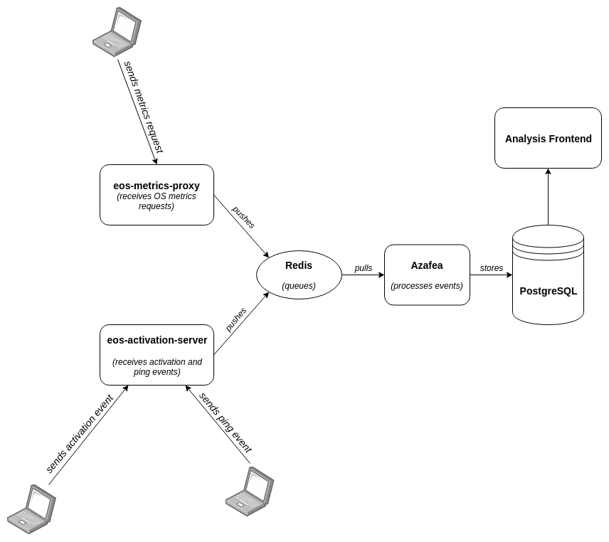

==================================================
Welcome to the Azafea metrics proxy documentation!
==================================================

The Azafea metrics proxy is part of the server backend for the Endless usage
metrics gathering and processing.

The metrics proxy is responsible for receiving the metrics requests from the
clients and passing them for processing to Azafea through Redis.

.. toctree::
   :maxdepth: 2
   :caption: Contents:

   install
   configuration
   contribute
